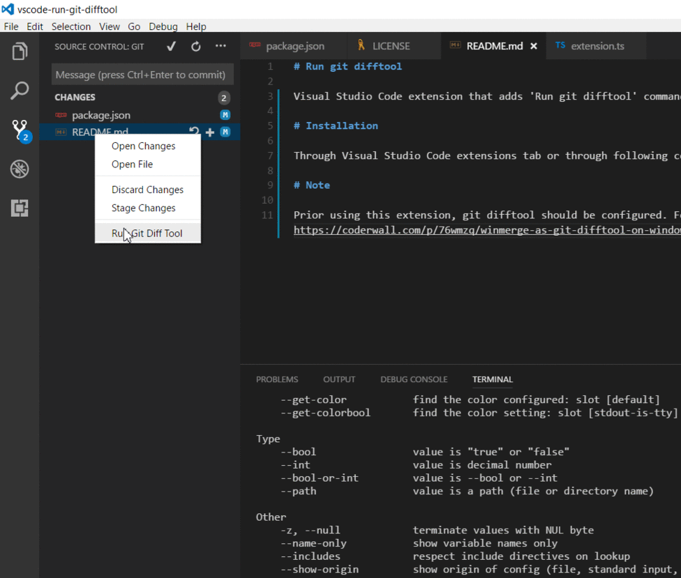

# Run git difftool 

Visual Studio Code extension that adds 'Run git difftool' command to file context menu in source control explorer

# Installation

Through Visual Studio Code extensions tab or through the following command: 'ext install vscode-run-git-difftool'

# Note

Before using this extension, git difftool should be configured. For instance, WinMerge can be set as difftool as shown here: https://coderwall.com/p/76wmzq/winmerge-as-git-difftool-on-windows

Extension is tested on Windows 10
